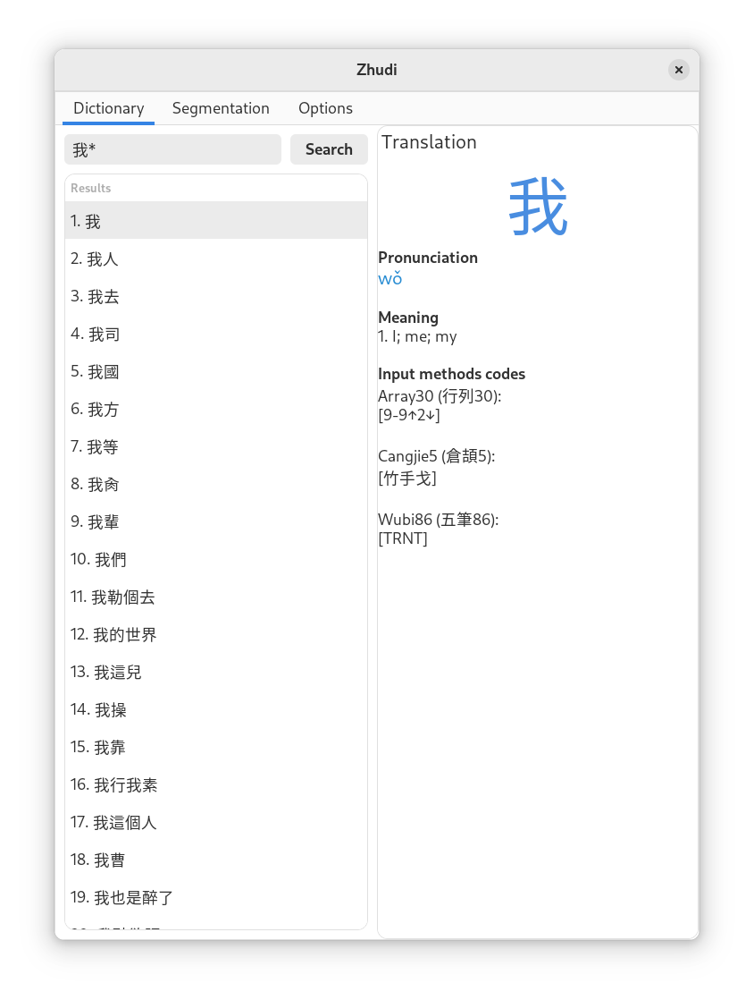

# What is Zhudi?
Zhudi is a graphical interface to CEDICT, CFDICT, HanDeDict, ChE-Dicc). Therefore, it allows you to have a Chinese to English, French, German and Spanish dictionary.

Zhudi is designed to help users by providing them good choices. Consequently, a Bopomofo engine is included to provide pronunciation along with pinyin. Traditional and simplified characters are fully supported too.

## What platforms are supported?
Since this project is written in Python 3, it should be able to run on any given platform. However, I only have tested it under GNU/Linux.

Currently, Zhudi can easily be installed on Archlinux from AUR.

## What are the dependencies of Zhudi?
In order to run Zhudi, you need the following packages:
* python 3+
* python-gobject
* pygobject-devel
* gobject-introspection

## Versions

Version 0.9 is made to work with python2 and is now obsolete. You should use version 1.0 and later instead.

## Installation

### Pip

Zhudi can be installed using python's package manager `pip` as follows:

    pip install git+https://github.com/Jiehong/Zhudi

### Dev

Locally, you can use poetry.

First time:

    poetry install

Then:

    poetry run python zhudi/zhudi_gui.py -p pinyin -z zhuyin -tr translation -td traditional -sd simplified

## Launching

Zhudi can be launched from the command line by providing it proper files.

### First launch
When you first launch Zhudi, you need to provide a dictionary file. You are free to use the one you like among:
* [CEDICT](http://www.mdbg.net/chindict/chindict.php?page=cedict) for English-Chinsese ;
* [CFDICT](http://www.chine-informations.com/chinois/open/CFDICT/) for French-Chinese ;
* [HanDeDict](http://www.handedict.de/chinesisch_deutsch.php) For German-Chinese ;
* [ChE-DICC](http://cc-chedicc.wikispaces.com/) for Spanish-Chinese.

You have to download the *.u8 version of the dictionary for using with Zhudi. Once you have downloaded it, simply run Zhudi to prepare the dictionary for future uses. Here is an example with the CEDICT dictionary (cedict.u8):

    zhudi -s cedict.u8

When Zhudi is finished, it would have created 5 files: pinyin, zhuyin, simplified, traditional and translation.

### Normal GUI usage
When the previous 5 files are created, you can simply launch Zhudi:

    zhudi -p pinyin -z zhuyin -tr translation -td traditional -sd simplified

However, you can just copy these files in your ~/.zhudi/ directory and launch Zhudi without arguments:

    zhudi

You should see the GUI up and running:

### Command line usage
When the `First launch` part has been run, you also have access to a limited command line search as follows:

    $ zhu 我
    我    ㄨㄛˇ    I
               ⇾ me

Unlike the GUI, this only provides the first and best match so far.

## Unit tests
dict_test.u8 is used to test the splitting of the dictionary, and then for the rest of the unittests.

First, test that splitting the dictionary is working well:

    poetry run python test_cli.py

Then, test the rest of the units:

    poetry run python -m unittest

## Formatting

Source files are formatted with `black`:

    poetry run python -m black zhudi && poetry run python -m black tests
